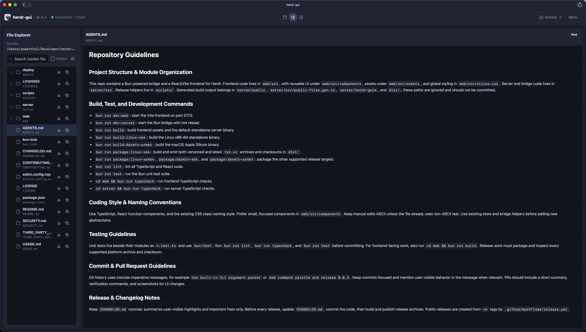
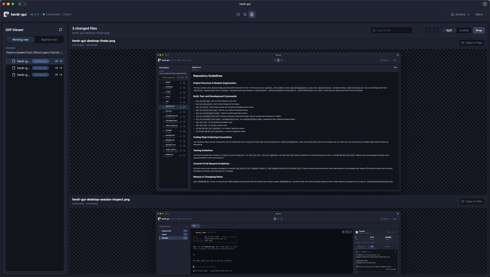
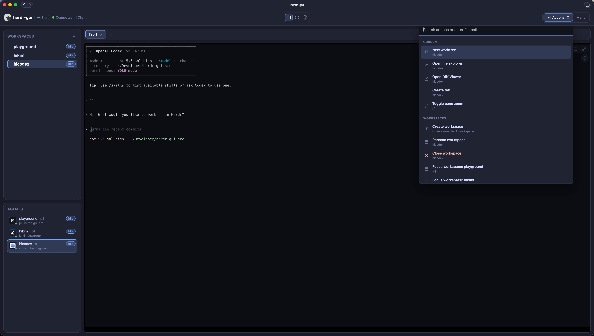
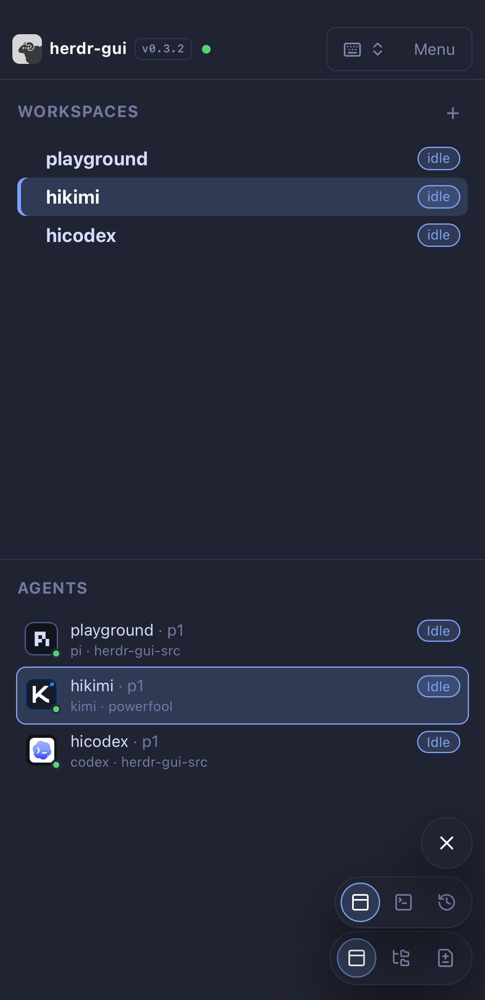
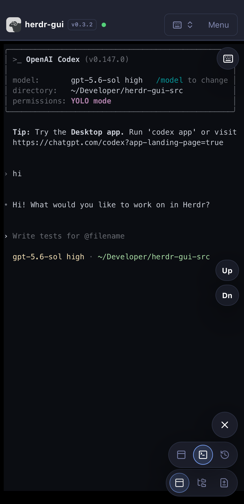
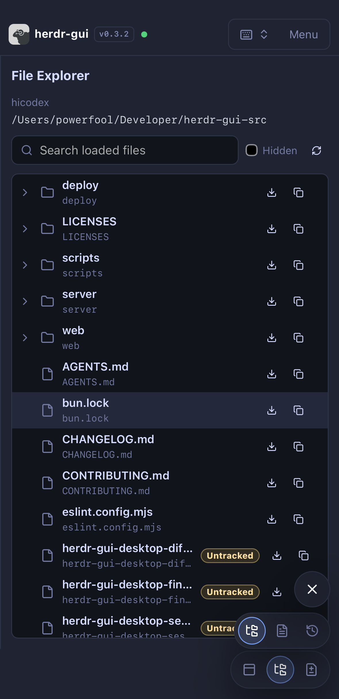

# herdr-gui

A minimal **web GUI client** for [Herdr](https://herdr.dev). It talks to a
running Herdr server through its local socket API and gives you a browser
dashboard: workspace/tab/pane tree, a spatial layout view, agent status, and
basic pane control (send text, read output, split/close/zoom).

See [FEATURES.md](./FEATURES.md) for a complete feature tour, keyboard
shortcuts, and repository-local Paseo worktree hooks.

中文使用说明见 [USAGE.md](./USAGE.md)。长期运行可直接使用
[`herdr-gui service`](#run-as-a-user-service) 安装 systemd/launchd 用户服务。

## Screenshots

### Desktop

[![Desktop workspace with a live terminal and session inspector][desktop-session]][desktop-session]

Workspace terminal with live agent and session inspection.

<!-- markdownlint-disable MD033 -->

<table width="100%">
  <thead>
    <tr>
      <th width="33.33%" align="center">File explorer</th>
      <th width="33.33%" align="center">Diff viewer</th>
      <th width="33.33%" align="center">Command palette</th>
    </tr>
  </thead>
  <tbody>
    <tr>
      <td width="33.33%" align="center" valign="top">
        <a href="./docs/images/herdr-gui-desktop-finder.png"></a>
      </td>
      <td width="33.33%" align="center" valign="top">
        <a href="./docs/images/herdr-gui-desktop-diff-viewer.png"></a>
      </td>
      <td width="33.33%" align="center" valign="top">
        <a href="./docs/images/herdr-gui-desktop-terminal.png"></a>
      </td>
    </tr>
  </tbody>
</table>

### Mobile

<table width="100%">
  <thead>
    <tr>
      <th width="33.33%" align="center">Workspaces and agents</th>
      <th width="33.33%" align="center">Full terminal control</th>
      <th width="33.33%" align="center">File explorer</th>
    </tr>
  </thead>
  <tbody>
    <tr>
      <td width="33.33%" align="center" valign="top">
        <a href="./docs/images/herdr-gui-mobile-workspaces.png"></a>
      </td>
      <td width="33.33%" align="center" valign="top">
        <a href="./docs/images/herdr-gui-mobile-terminal.png"></a>
      </td>
      <td width="33.33%" align="center" valign="top">
        <a href="./docs/images/herdr-gui-mobile-finder.png"></a>
      </td>
    </tr>
  </tbody>
</table>

<!-- markdownlint-enable MD033 -->

Click any screenshot to open the full-resolution image.

[desktop-session]: ./docs/images/herdr-gui-desktop-session-inspect.png

## Install

Herdr must be installed and running before starting herdr-gui. The installer
supports Linux and macOS on x86-64 and arm64, verifies the release checksum,
and installs the standalone binary to `~/.local/bin/herdr-gui`:

```bash
curl -fsSL \
  https://github.com/powerfooI/herdr-gui/releases/latest/download/install-herdr-gui.sh \
  | sh
```

Make sure `~/.local/bin` is in `PATH`, then start the application:

```bash
herdr-gui --version
herdr-gui
```

Open the URL printed by the process. To update, run the installer again. For a
long-running installation managed by systemd or launchd, run:

```bash
herdr-gui service install
```

See [USAGE.md](./USAGE.md#安装和更新) for fixed-version installation,
authentication, remote Herdr connections, and service configuration.

## Recommended: install as a PWA

For day-to-day use, we recommend installing herdr-gui as a standalone web app
instead of keeping it in a normal browser tab. This gives it a dedicated app
window and icon while removing browser chrome from the terminal UI.

First start herdr-gui and authenticate with the URL printed by the process, then
install it from your browser:

- **iPhone or iPad (Safari):** tap **Share** → **Add to Home Screen**, keep
  **Open as Web App** enabled, then tap **Add**.
- **macOS (Safari 17+):** choose **File** → **Add to Dock**.
- **Chrome or Edge:** choose **Install app** from the browser menu. If only
  **Create shortcut** is available, enable **Open as window**.

Launch herdr-gui afterward from the Home Screen, Dock, or Applications folder.
The installed app still requires the herdr-gui server to be running and
reachable; PWA mode does not provide offline access.

## Architecture

Browsers can't open Unix domain sockets, so a tiny local **bridge** sits between
the browser and Herdr:

```text
Browser (React + Vite)
   │  WebSocket (JSON: RPC + pushed events)
   ▼
Bridge (Bun + TypeScript)  ──  node:net NDJSON  ──▶  ~/.config/herdr/herdr.sock
```

The bridge mirrors Herdr's socket methods over a WebSocket: the frontend sends
`{ id, method, params }`, the bridge forwards to Herdr, and returns
`{ id, result }` / `{ id, error }`. Herdr events (from `events.subscribe`) are
broadcast to every connected browser as `{ event: ... }`.

## Requirements

- Herdr running locally (`herdr` server up, socket at `~/.config/herdr/herdr.sock`)
- [Bun](https://bun.sh) >= 1.3 for source builds

## Development

```bash
# 1) start the bridge (talks to herdr.sock, serves ws://localhost:8787/ws)
bun run dev:server

# 2) in another shell, start the web app (http://localhost:5173)
bun run dev:web
```

Then open <http://localhost:5173>.

Use `bun run format` to format supported files with the repository's pinned
Biome version and `bun run format:check` to verify formatting without writing.

## Manage multiple Herdr connections

Use the connection selector beside the application title to add, test, connect,
disconnect, edit, and remove Herdr servers. Profiles are shared by every
authenticated browser connected to the bridge, while each browser independently
selects the connection it displays. Local profiles attach to existing Unix
sockets; they never start Herdr.


SSH profiles require an already-running remote Herdr server and accept only an
OpenSSH alias or `user@host`, plus explicit remote control and render socket
paths. Configure ports, jump hosts, identities, and other transport details in
`~/.ssh/config`; herdr-gui uses the normal OpenSSH host-key and agent/Keychain
policies and does not store passwords, private keys, passphrases, or arbitrary
SSH options. A typical profile uses:

```text
Destination: workbox
Control socket: /home/you/.config/herdr/herdr.sock
Render socket:  /home/you/.config/herdr/herdr-client.sock
```

Connection profiles are stored atomically in
`~/.config/herdr-gui/connections.json` with private directory and file modes.
The bridge supervises each SSH tunnel independently and retries only transient
transport failures. The legacy CLI/environment connection remains available as
a read-only process default when those options are explicit.

The selector is keyboard accessible: tab to its trigger, open it with Enter,
Space, Arrow Up, or Arrow Down, then use the arrow, Home, and End keys. There is
currently no global next/previous-connection shortcut.

## Configuration (CLI flags **or** env vars)

Flags override env vars, which override defaults. Run `herdr-gui --help` for the
full list.

| Flag | Env var | Default |
| --- | --- | --- |
| `--host <addr>` | `HOST` | `127.0.0.1` |
| `--port <n>` | `PORT` | `8787` |
| `--password <pw>` | `HERDR_GUI_PASSWORD` | _(generated token for non-localhost)_ |
| `--allowed-origins <list>` | `HERDR_GUI_ALLOWED_ORIGINS` | _(same-origin WebSocket only)_ |
| `--socket-path <path>` | `HERDR_SOCKET_PATH` | `~/.config/herdr/herdr.sock` |
| `--client-socket-path <p>` | `HERDR_CLIENT_SOCKET_PATH` | `~/.config/herdr/herdr-client.sock` |
| `--ssh-host <user@host>` | `HERDR_SSH_HOST` | _(auto tunnel remote Herdr sockets)_ |
| `--session <name>` | `HERDR_SESSION` | _(named herdr session)_ |
| `--public-dir <path>` | `PUBLIC_DIR` | _(embedded assets)_ |
| `--open` | `OPEN_BROWSER=1` | _(disabled)_ |

Additional runtime settings:

| Environment variable | Purpose |
| --- | --- |
| `HERDR_GUI_UPDATE_BASE_URL` | Override the latest release asset directory (HTTPS; loopback HTTP allowed) |
| `HERDR_GUI_DISABLE_UPDATE_CHECK=1` | Disable update checks |
| `HERDR_GUI_RESTART_SUPERVISOR=0\|1` | Declare or override external supervisor detection |

### Reverse proxies that rewrite the Host header

The bridge accepts browser WebSocket upgrades only when the request `Origin`
matches the request host. Reverse proxies that terminate TLS and forward to an
internal address rewrite the `Host` header, which breaks that match and leaves
the UI stuck at "Browser disconnected from bridge". List each public origin
the GUI is reached through, for example:

```sh
HERDR_GUI_ALLOWED_ORIGINS=https://gui.example.com herdr-gui --host 0.0.0.0
```

Entries are comma-separated origins (scheme + host + optional port); entries
without a scheme match both `http` and `https` on that host. Prefer
configuring the proxy to preserve the original `Host` header when possible.

A custom update mirror uses the same flat asset layout as GitHub Releases. It
must provide each platform archive, its `.sha256` file, and the corresponding
`herdr-gui-<platform>.update.json` metadata file. Update base URLs containing
credentials, query strings, or fragments are rejected so secrets cannot leak
through update status responses or process arguments. HTTPS is required except
for mirrors bound to the local loopback interface.

```bash
# local use (no auth)
./herdr-gui

# listen on all interfaces with a generated token
./herdr-gui --host 0.0.0.0 --port 8787
# prints URLs such as http://192.0.2.23:8787/?token=<token>

# optionally use a fixed password and the login page instead
./herdr-gui --host 0.0.0.0 --port 8787 --password 's3cr3t'
```

## Run as a user service

The standalone binary can install and manage the platform-native user service:

```bash
herdr-gui service install
herdr-gui service status
herdr-gui service restart
herdr-gui service reload
herdr-gui service uninstall
```

| Command | Behavior |
| --- | --- |
| `service install` | Create or update the user-service definition and start it |
| `service install --force` | Replace an existing definition not generated by herdr-gui |
| `service status` | Show the native service-manager status |
| `service restart` | Restart the process after changing `herdr-gui.env` |
| `service reload` | Reload the systemd/launchd definition, then restart |
| `service uninstall` | Stop the service and remove its definition; preserve config and token files |

Verify the running service with:

```bash
curl -fsS http://127.0.0.1:8787/healthz
```

Linux uses a systemd user service with `Restart=always`; macOS uses a launchd
LaunchAgent with `KeepAlive`. A new service listens on `0.0.0.0:8787`, creates
the persistent login token, and prints tokenized localhost and LAN URLs during
installation. The command creates
`~/.config/herdr-gui/herdr-gui.env` with mode `0600` when missing and preserves
it on reinstall or uninstall. Edit that file for `HOST`, `PORT`, an optional
fixed password, and Herdr connection settings, then run
`herdr-gui service restart`. Use
`herdr-gui service uninstall` to remove the service definition.
Use `herdr-gui service reload` after editing the systemd unit or launchd plist;
it reloads the platform definition and restarts the process.

The random token is stored in `~/.config/herdr-gui/auth-token` with mode `0600`.
A successful visit to a printed `?token=...` URL sets the normal HttpOnly
session cookie and immediately removes the token from the address bar. Delete
the token file while the service is stopped, then run `service restart`, to
rotate the token.

The templates under `deploy/` remain available for manual installation and
customization. On Linux, enable linger with
`sudo loginctl enable-linger "$USER"` when the user service must survive logout.

When a deployment requires a custom process wrapper, replace `ExecStart` with
its absolute executable path and keep systemd as the restart owner:

```ini
[Service]
ExecStart=
ExecStart=/absolute/path/service-wrapper -- %h/.local/bin/herdr-gui --host 0.0.0.0
```

The updater saves the replaced executable as `herdr-gui.previous`, atomically
installs the verified binary, and exits; it never starts a replacement process.
See the detailed [user-service guide](./USAGE.md#使用用户服务管理) for
generated file locations, installation, verification, logging, and update
behavior. Subsequent `herdr-gui service install` runs preserve a custom
`ExecStart` from a managed unit when it still invokes the same herdr-gui binary.

## Build / distribute a single-file executable

The project builds into one self-contained executable (Bun runtime + the
embedded frontend). No need for the target machine to have Bun installed.

```bash
bun run build          # builds the web app, embeds it, compiles the binary
# → server/herdr-gui
```

Cross-compile for other platforms (Bun downloads the target runtime
automatically):

```bash
bun run build:linux-x64   # → server/herdr-gui-linux-x64   (x86-64 Linux, glibc)
bun run build:linux-arm64 # → server/herdr-gui-linux-arm64 (arm64 Linux, glibc)
bun run build:darwin-x64  # → server/herdr-gui-darwin-x64  (Intel macOS)
bun run build:darwin-arm64 # → server/herdr-gui-darwin-arm64 (Apple Silicon)
bun run build:all
```

> **Linux x86-64 note:** use the **glibc** build (`herdr-gui-linux-x64`) for
> Ubuntu / Debian / Fedora / CentOS. The musl build currently fails to start on
> glibc hosts because Bun's musl binary still dynamically links `libstdc++` /
> `libgcc_s`.

Run it:

```bash
./server/herdr-gui     # opens http://localhost:8787 by default
```

The executable serves the embedded frontend, the `/ws` bridge, and the `/api`
endpoints, and connects to your local Herdr sockets. Distribute the single
`herdr-gui` file; users run it and open the printed URL.

## npm / npx distribution

`herdr-gui` can be published as an npm package, but there are two distinct
distribution models:

- **Node-native package:** `npx herdr-gui` runs with the user's Node runtime and
  does not bundle Bun. This requires porting the bridge away from Bun APIs
  (`Bun.serve`, `Bun.spawn`, `Bun.file`, `Bun.write`) to Node HTTP/WebSocket/fs
  APIs.
- **Binary-wrapper package:** `npx herdr-gui` selects and runs a precompiled
  platform binary. Users do not need Bun installed, but the package still ships
  binaries that embed the Bun runtime.

The current implementation is Bun-based, so the single-file executable path is
the supported distribution path today. A true Node-only `npx` package is
possible, but it is a separate server-runtime port rather than a packaging-only
change.

For remote Herdr sessions, pass `--ssh-host`; herdr-gui will create SSH
Unix-socket forwards for both the control and terminal-render sockets:

```bash
./herdr-gui --ssh-host user@host
```

`--ssh-host` also makes pasted images, workspace file operations, and
repository worktree-hook execution happen on the remote host. If you need custom
local socket paths, pass `--socket-path <path>` and
`--client-socket-path <path>` explicitly; those flags
override the automatic tunnel paths.

## Stack

- Bridge: Bun, `node:net`. Speaks both Herdr protocols — the NDJSON control
  API (`herdr.sock`) and the bincode thin-client render protocol
  (`herdr-client.sock`) — and bridges them to a WebSocket.
- Web: Vite + React + TypeScript, `xterm.js` for the terminal view (renders the
  server-rendered ANSI stream at the exact client cols×rows).

## Security

herdr-gui can control terminal sessions and modify workspace files. Keep the
default loopback binding unless you understand the trust boundary. See
[SECURITY.md](./SECURITY.md) before exposing the service to another device.

## Contributing and License

See [CONTRIBUTING.md](./CONTRIBUTING.md) for development and validation
instructions. The project code is available under the [MIT License](./LICENSE).
Bundled fonts and brand assets retain their original terms; see
[THIRD_PARTY_NOTICES.md](./THIRD_PARTY_NOTICES.md).
