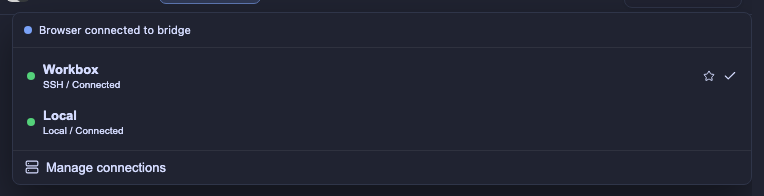

# Installation and Deployment

This guide covers installation, runtime configuration, remote connections,
user services, and standalone builds.

## Requirements

- A running Herdr server.
- The default Herdr sockets at `~/.config/herdr/herdr.sock` and
  `~/.config/herdr/herdr-client.sock` on Unix, or the corresponding
  `%APPDATA%\herdr\` named pipes on Windows.
- [Bun](https://bun.sh) 1.4 or newer for source builds. Standalone binaries do
  not require Bun on the target machine.

## Install a release

The installer supports Linux and macOS on x86-64 and arm64. It verifies the
release checksum and installs the standalone binary to
`~/.local/bin/herdr-gui`:

```bash
curl -fsSL \
  https://github.com/powerfooI/herdr-studio/releases/latest/download/install-herdr-gui.sh \
  | sh
```

Make sure `~/.local/bin` is in `PATH`, then run:

```bash
herdr-gui --version
herdr-gui
```

Open the URL printed by the process. Run the installer again to update.

Windows releases provide x64 and ARM64 archives containing `herdr-gui.exe`.
Download the matching `herdr-gui-windows-<arch>.tar.xz` and `.sha256` files from
the [latest release](https://github.com/powerfooI/herdr-studio/releases/latest),
verify the checksum with `Get-FileHash`, and extract the archive with Windows
11's built-in `tar.exe`. Releases predating native ARM64 support contain only
the x64 archive; prefer the native ARM64 package when it is available.

To install into a system directory, set `HERDR_GUI_INSTALL_DIR`:

```bash
curl -fsSL \
  https://github.com/powerfooI/herdr-studio/releases/latest/download/install-herdr-gui.sh \
  | sudo env HERDR_GUI_INSTALL_DIR=/usr/local/bin sh
```

Set `HERDR_GUI_VERSION` to install a fixed release instead of `latest`:

```bash
curl -fsSL \
  https://github.com/powerfooI/herdr-studio/releases/latest/download/install-herdr-gui.sh \
  | HERDR_GUI_VERSION=0.4.8 sh
```

`HERDR_GUI_RELEASE_BASE_URL` selects a compatible flat release mirror. Mirrors
must use HTTPS, except for loopback testing, and their URLs cannot contain
credentials, query strings, or fragments. The installer and in-app updater
preserve a replaced executable as `herdr-gui.previous` for manual recovery.

## Basic runtime configuration

Flags override environment variables, which override defaults. Run
`herdr-gui --help` for the complete list.

| Flag | Environment variable | Default |
| --- | --- | --- |
| `--host <addr>` | `HOST` | `127.0.0.1` |
| `--port <n>` | `PORT` | `8787` |
| `--password <pw>` | `HERDR_GUI_PASSWORD` | Generated token for non-loopback binds |
| `--socket-path <path>` | `HERDR_SOCKET_PATH` | Default Herdr control socket or named pipe |
| `--client-socket-path <path>` | `HERDR_CLIENT_SOCKET_PATH` | Default Herdr render socket or named pipe |
| `--ssh-host <user@host>` | `HERDR_SSH_HOST` | Disabled; supported on Linux and macOS |
| `--session <name>` | `HERDR_SESSION` | Named Herdr session, if set |
| `--public-dir <path>` | `PUBLIC_DIR` | Embedded assets |
| `--open` | `OPEN_BROWSER=1` | Disabled |

Additional runtime settings:

| Environment variable | Purpose |
| --- | --- |
| `HERDR_GUI_UPDATE_BASE_URL` | Override the latest-release asset directory |
| `HERDR_GUI_DISABLE_UPDATE_CHECK=1` | Disable update checks |
| `HERDR_GUI_RESTART_SUPERVISOR=0\|1` | Declare or override external supervisor detection |

A custom update mirror must use the same flat asset layout as GitHub Releases
and provide each platform archive, its `.sha256` file, and the corresponding
`herdr-gui-<platform>.update.json` metadata file. HTTPS is required except for
loopback test mirrors. URLs containing credentials, query strings, or fragments
are rejected.

Common examples:

```bash
# Local use without authentication
herdr-gui

# Listen on all interfaces with a generated token
herdr-gui --host 0.0.0.0 --port 8787

# Use a fixed password and the login page
herdr-gui --host 0.0.0.0 --port 8787 --password 's3cr3t'
```

Read [SECURITY.md](../SECURITY.md) before using a non-loopback bind.

## Multiple and remote Herdr connections

Use the connection selector beside the application title to add, test, connect,
disconnect, edit, and remove Herdr servers. Profiles are shared by authenticated
browsers, while each browser independently selects the connection it displays.
Local profiles attach to existing sockets and never start Herdr. When the first
profile is created, the default local server remains available as a writable
`Local` profile.



The selector is keyboard accessible. Focus its trigger and open it with Enter,
Space, Arrow Up, or Arrow Down; navigate with the arrow, Home, and End keys.
There is currently no global next/previous-connection shortcut.

SSH profiles require an already-running remote Herdr server and accept only an
OpenSSH alias or `user@host`. Leave the remote control and render socket paths
empty to resolve the default sockets under the remote home directory. Configure
ports, jump hosts, identities, and other transport details in `~/.ssh/config`.
Herdr Studio follows normal OpenSSH host-key and agent or Keychain policies; it
does not store passwords, private keys, passphrases, or arbitrary SSH options.

```text
Destination: workbox
Control socket: (empty - auto)
Render socket:  (empty - auto)
```

SSH profiles and `--ssh-host` currently require Herdr Studio to run on Linux or
macOS because the stream-local transport cannot expose a forwarded Unix socket
as a local Windows named pipe. Windows supports native local Herdr profiles.

Profiles are stored atomically in `~/.config/herdr-gui/connections.json` with
private directory and file modes. The bridge supervises each SSH tunnel
independently and retries transient transport failures. See
[Architecture](./ARCHITECTURE.md#connection-isolation) for the isolation model
and [Multi-Herdr Connections](./multi-herdr-connections-implementation.md) for
the detailed implementation contract.

The legacy command-line connection is also available:

```bash
herdr-gui --ssh-host user@host
```

It forwards both control and terminal-render sockets. Image paste, workspace
file operations, Git operations, and repository worktree hooks then run on the
remote host. Explicit `--socket-path` and `--client-socket-path` values override
the automatically selected tunnel paths.

## Run as a user service

The standalone binary can install and manage a platform-native user service:

```bash
herdr-gui service install
herdr-gui service status
herdr-gui service restart
herdr-gui service reload
herdr-gui service uninstall
```

| Command | Behavior |
| --- | --- |
| `service install` | Create or update the service definition and start it |
| `service install --force` | Replace a definition not generated by Herdr Studio |
| `service status` | Show native service-manager status |
| `service restart` | Restart after changing `herdr-gui.env` |
| `service reload` | Reload the platform definition, then restart |
| `service uninstall` | Stop and remove the service while preserving configuration and tokens |

Verify the running service with:

```bash
curl -fsS http://127.0.0.1:8787/healthz
```

Linux uses a systemd user service with `Restart=always`; macOS uses a launchd
LaunchAgent with `KeepAlive`; Windows registers a current-user Task Scheduler
job that starts at login, runs with normal privileges, and restarts on failure.

A new service listens on `0.0.0.0:8787`, creates a persistent login token, and
prints tokenized localhost and LAN URLs during installation. Configuration is
stored in `~/.config/herdr-gui/herdr-gui.env` on Unix or
`%APPDATA%\herdr-gui\herdr-gui.env` on Windows and is preserved on reinstall or
uninstall. Edit that file for `HOST`, `PORT`, an optional fixed password, and
Herdr connection settings, then run `herdr-gui service restart`.

The random token is stored in `~/.config/herdr-gui/auth-token` on Unix and
`%APPDATA%\herdr-gui\auth-token` on Windows. Visiting a printed `?token=...` URL
sets an HttpOnly session cookie and removes the token from the address bar. To
rotate the token, stop the service, delete the token file, and restart.

On Windows, approve the Task Scheduler or firewall prompt if one appears. Allow
Private networks only, or set `HOST=127.0.0.1` before installation for
local-only access. On Linux, enable linger with
`sudo loginctl enable-linger "$USER"` if the service must survive logout.

Templates under `deploy/` remain available for manual customization. A custom
systemd wrapper should replace `ExecStart` while leaving systemd as the restart
owner:

```ini
[Service]
ExecStart=
ExecStart=/absolute/path/service-wrapper -- %h/.local/bin/herdr-gui --host 0.0.0.0
```

The updater saves the replaced executable as `herdr-gui.previous`, atomically
installs the verified binary, and exits. It never starts a replacement process.
A subsequent `service install` preserves a custom `ExecStart` from a managed
unit when it still invokes the same Herdr Studio binary.

## Build a standalone executable

The build embeds the frontend and Bun runtime in a self-contained executable:

```bash
bun run build
# server/herdr-gui
```

The executable serves the frontend, WebSocket bridge, and HTTP APIs and connects
to the configured Herdr sockets. The target machine does not need Bun.

Cross-compile or package supported targets with:

```bash
bun run build:linux-x64
bun run build:linux-arm64
bun run build:darwin-x64
bun run build:darwin-arm64
bun run build:windows-x64
bun run build:windows-arm64
bun run build:all

bun run package:linux-x64
bun run package:linux-arm64
bun run package:darwin-x64
bun run package:darwin-arm64
bun run package:windows-x64
bun run package:windows-arm64
```

Bun downloads the target runtime automatically. Use the glibc Linux x86-64
build for Ubuntu, Debian, Fedora, and CentOS; the musl build is not supported on
these hosts because Bun's musl binary still dynamically links `libstdc++` and
`libgcc_s`.

Run or clean a local build with:

```bash
./server/herdr-gui
bun run clean
```

## Troubleshooting

### Herdr Studio cannot connect to Herdr

Confirm that Herdr is running and that its control socket exists:

```bash
ls ~/.config/herdr/herdr.sock
herdr-gui --socket-path /path/to/herdr.sock
```

### Another device cannot open Herdr Studio

Listen on all interfaces, use the tokenized URL printed at startup, and confirm
that both devices are on the same network and the firewall allows the port:

```bash
herdr-gui --host 0.0.0.0 --port 8781
```

### `--ssh-host` still connects locally

Do not also set `--socket-path`, `--client-socket-path`, `HERDR_SOCKET_PATH`, or
`HERDR_CLIENT_SOCKET_PATH`; explicit socket paths override automatic SSH
tunnels.

### Open the browser automatically

Pass `--open` or set `OPEN_BROWSER=1`:

```bash
herdr-gui --open
```

For release preparation and platform packaging requirements, see
[AGENTS.md](../AGENTS.md).
